# ESS 배터리 수명 예측 
배터리 셀의 초기 100사이클 방전 용량 곡선으로 최종 Cycle Life를 예측한다. Batch 1에서 모델을 학습·선택하고, Batch 2에서 배치 간 일반화 성능을 최종 평가한다.


## 프로젝트 개요
- 데이터셋 : MIT-Stanford Battery Dataset (Severson et al., Nature Energy 2019)
- 학습 데이터 : Batch 1 (2017-05-12)
- 평가 데이터 : Batch 2 (2018-02-20)
- 태스크 : Regression (Cycle Life 예측)
- Target : `cycle_life` — 원자료에 기록된 EOL 도달까지의 총 사이클 수
- 입력 피처 : `dq_min`, `log_dq_var`
- 검증 데이터 : Batch 1 내 충전 프로토콜 그룹 Hold-out
- 평가 지표 : MAPE (%), 원논문 참고값 9.1%


## 파일 구조 (sample) 
```text
├── images/                         
│   ├── Batch1_*.png
│   ├── Batch2_*.png
│   └── Batch3_*.png
├── ess-battery-project/
│   ├── DS-MINI-Design-울산_3반-엄진용.ipynb
│   ├── DS-MINI-Design-울산_3반-엄진용.before-modeling.ipynb
│   ├── run_project.py              # 단일 파일 실행: EDA → Train/CV → Valid → Test
│   └── model_outputs/
│       ├── batch1_split_manifest.csv
│       ├── batch1_nested_cv.csv
│       ├── batch1_candidate_performance.csv
│       ├── train_feature_audit.csv
│       ├── selection_lock.json
│       ├── selected_model_performance.csv
│       ├── batch2_predictions.csv
│       ├── batch2_exclusions.csv
│       ├── batch2_final_test.png
│       ├── run_environment.json     # Python 실행 시 생성
│       └── eda/                    # Python 실행 시 생성되는 Batch 1 EDA 표·그래프
├── .env                            # 로컬 데이터 경로 설정 (Git 제외)
├── .env.example                    # 공유용 설정 예시
├── requirements.txt
└── README.md
```


## 환경 설정 (sample) 
Python 3.11 또는 3.12를 사용한다. `requirements.txt`는 두 버전에서 설치할 수 있는 패키지 버전을 고정한다. 기존 성능표는 이전 검증 환경의 결과이므로 패키지 버전 변경 시 실행 결과에 차이가 날 수 있다.

프로젝트 루트의 `.env` 파일에서 데이터 폴더 경로를 지정한다. Python 파일이나 터미널 인자에서 데이터 경로를 수정할 필요가 없다.

```dotenv
# .env: 상대 경로는 프로젝트 루트 기준
DATA_DIR="../Data"
```

- 현재 `.env`는 프로젝트와 나란히 있는 `Data` 폴더를 가리킨다. 다른 환경에서는 `DATA_DIR`을 실제 폴더 경로로 수정한다.
- 절대 경로도 사용할 수 있다. 공백이 포함된 경로는 위처럼 따옴표로 감싼다.
- 새로 복제한 저장소에는 `.env.example`을 `.env`로 복사한 뒤 경로를 설정한다. `.env`는 기존 `.gitignore`에 따라 Git에서 제외된다.
- 실행 위치와 관계없이 Python 파일이 프로젝트 루트의 `.env`를 읽는다. 원본 데이터는 저장소에 포함하지 않는다.

```bash
git clone https://github.com/eom-skala/DS-Mini_Design DS-Mini-Design
cd DS-Mini-Design
python3.11 -m venv .venv
source .venv/bin/activate
./.venv/bin/python -m pip install --upgrade pip
./.venv/bin/python -m pip install -r requirements.txt
cp .env.example .env
# .env의 DATA_DIR을 실제 데이터 폴더 경로로 수정
./.venv/bin/python ess-battery-project/run_project.py
```


- Batch 1 파일: `2017-05-12_batchdata_updated_struct_errorcorrect.mat`
- Batch 2 파일: `2018-02-20_batchdata_updated_struct_errorcorrect.mat`
- 기본 결과 경로는 `ess-battery-project/model_outputs/`이다. 다른 경로는 `--output-dir`로 지정한다.
- Python 파일은 노트북의 로딩·요약 통계·ΔQ 특징 분석과 모델 설계를 단일 실행으로 정리했다. 전체 raw 시계열 대신 필요한 필드를 읽고, EDA는 모델에 반영하지 않는 보고용으로 생성한다.
- CV·Hold-out·최종 Test는 노트북과 같은 두 피처, seed, 후보 모델, 탐색 범위를 사용한다. 모델 선택을 끝낸 뒤 Batch 2를 한 번만 평가하며, 한 번의 실행 안에서 Test를 튜닝에 사용하지 않는다.
- README의 Batch 1·2·3 이미지는 설계서의 기존 EDA 결과다. Python 파일의 EDA 출력은 제공된 노트북 범위인 Batch 1이며 Batch 3를 학습에 사용하지 않는다.
- 노트북을 별도로 실행하려면 기존 EDA에 사용하는 `mat73`와 Jupyter를 추가 설치하고 `DATA_DIR`을 설정한다. 단독 Python 실행에는 이 두 패키지가 필요하지 않다.

```bash
# 모델 평가만 실행하고 Batch 1 EDA 출력은 생략
./.venv/bin/python ess-battery-project/run_project.py --skip-eda

# Batch 2를 열지 않고 Batch 1 실행만 확인
./.venv/bin/python ess-battery-project/run_project.py --train-only

# 별도 결과 폴더로 출력
./.venv/bin/python ess-battery-project/run_project.py --output-dir "./results/run1"
```


## EDA 

- Cycle Life 분포
	- Batch 1: 평균 약 845사이클. 단수명(<500) 0%, 장수명(>1,000) 21.74% (10/46셀).
	- Batch 2: 수명 누락 셀을 제외하면 평균 약 566사이클. 단수명 71.79% (28/39셀), 장수명 7.69% (3/39셀).
	- Batch 3: 평균 약 1,060사이클. 단수명 0%, 장수명 52.27% (23/44셀).
	- 핵심 발견 : Batch별 수명 분포가 크게 다르다. IQR 이상치는 실제 장수명 셀일 수 있어 자동 삭제하지 않는다. Batch 3는 EDA 비교용이며 이번 모델 학습·평가에는 사용하지 않는다.


<details>
<summary>수명 분포·비율·이상치 이미지</summary>

| 그림           | Batch 1                                                        | Batch 2                                                        | Batch 3                                                        |
| -------------- | -------------------------------------------------------------- | -------------------------------------------------------------- | -------------------------------------------------------------- |
| Histogram      | 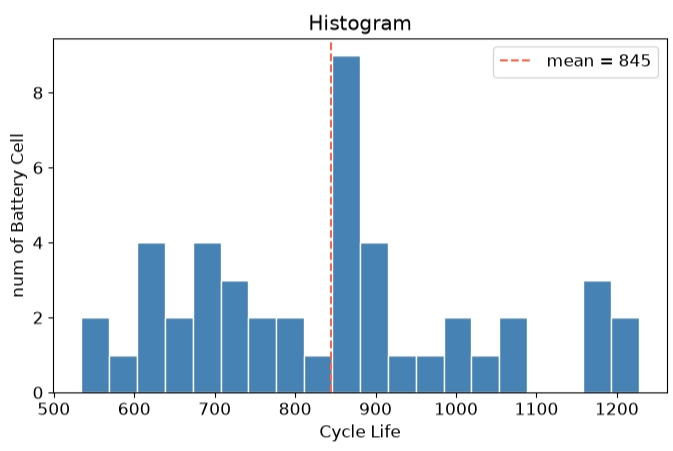              | 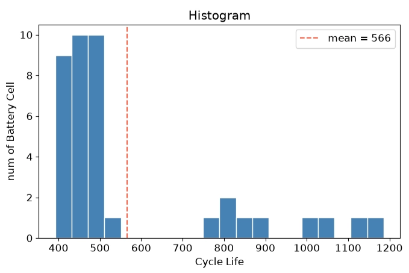              | 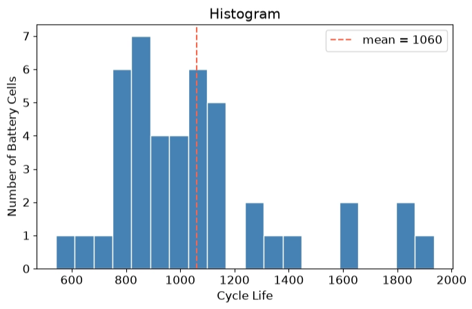              |
| 장·단수명 비율 | 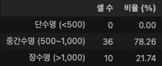 | 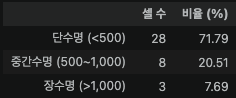 | 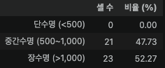 |
| Box Plot       | 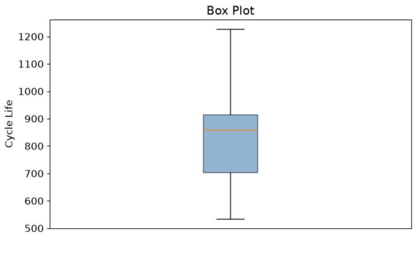                 | 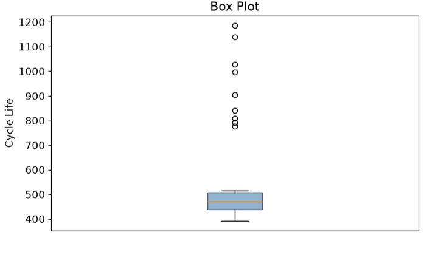                 | 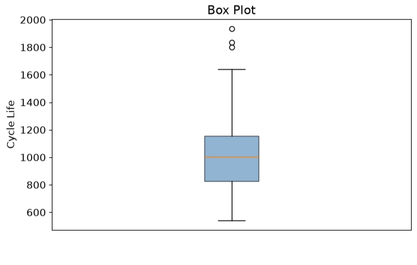                 |

</details>

- 열화 곡선 분석
	- 많은 셀은 초기 안정화·완만한 감소 이후 후기 감소 속도가 커진다. 일부 셀은 관측 종료까지 뚜렷한 가속이 없다.
	- Knee 후보는 Batch 2에서 약 250~400, 600~750, 800~1,000사이클, Batch 3에서 약 300~600, 600~1,000, 1,200~1,700사이클에 관찰된다.
	- 핵심 발견 : Knee는 셀별로 다르며 위 범위는 시각적 추정이다. 전체 열화 속도와 후기 Knee는 초기 예측 시점에 알 수 없어 입력에서 제외한다. 용량 필터로 곡선이 잘릴 수 있어 곡선 끝을 EOL로 단정하지 않는다.


<details>
<summary>사이클별 방전 용량 곡선</summary>

| 그림    | Batch 1                                       | Batch 2                                       | Batch 3                                       |
| ------- | --------------------------------------------- | --------------------------------------------- | --------------------------------------------- |
| Qd 곡선 | 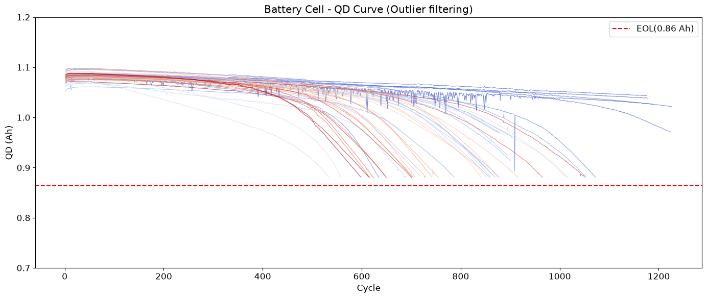 | 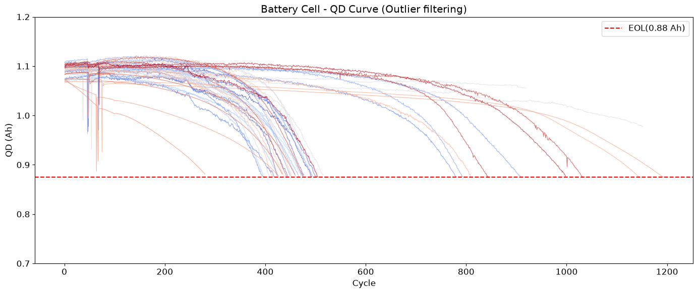 | 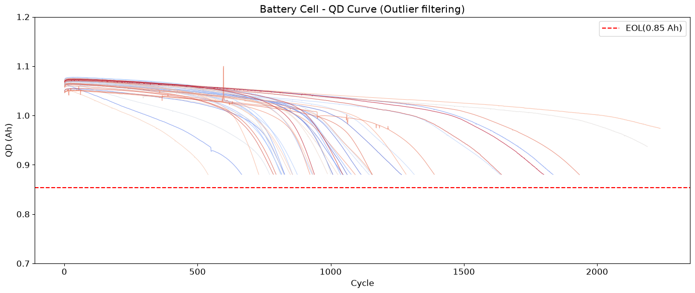 |

</details>

- ΔQ(V) 곡선 분석
	- 동일 전압에서 `ΔQ(V) = Q100(V) - Q10(V)`를 계산한다.
	- Batch 2의 단수명 셀(28개)은 장수명 셀(3개)보다 깊은 음의 골과 넓은 셀 간 편차를 보인다. 그룹 중앙값 곡선의 최저점은 각각 약 -0.055 Ah, -0.02 Ah이다.
	- 핵심 발견 : 초기 곡선의 감소 크기와 형태를 `dq_min`, `log_dq_var`로 요약한다. Batch 1·3에는 <500사이클 셀이 없어 동일 기준의 장·단수명 비교가 불가능하다.


<details>
<summary>ΔQ 곡선과 셀별 통계</summary>

| 그림            | Batch 1                                                   | Batch 2                                                   | Batch 3                                                   |
| --------------- | --------------------------------------------------------- | --------------------------------------------------------- | --------------------------------------------------------- |
| ΔQ(V) 개별 곡선 | 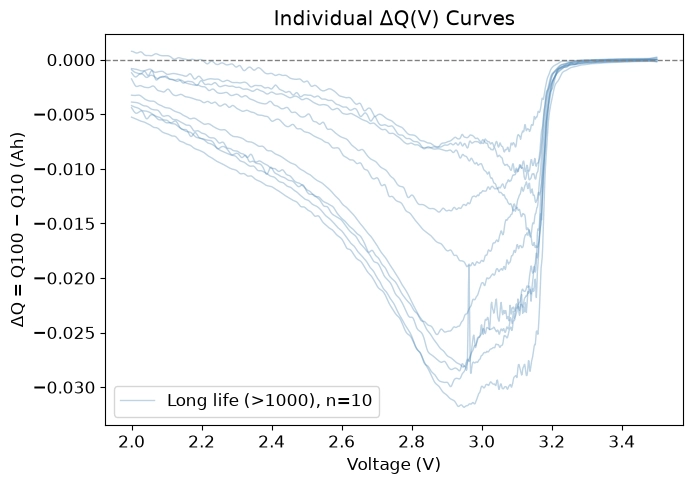 | 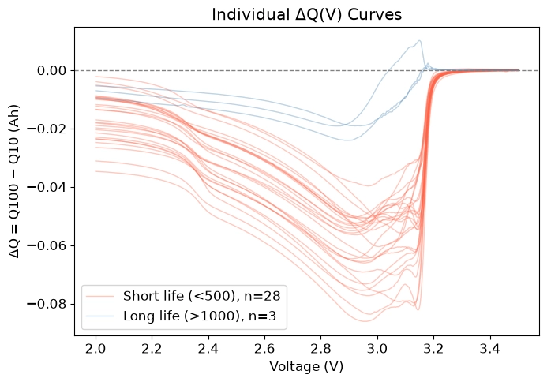 | 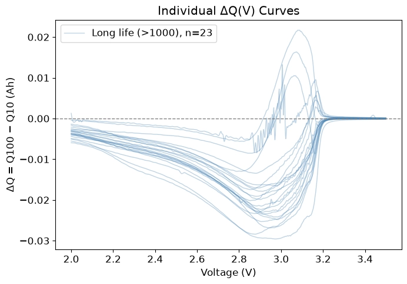 |
| ΔQ 셀별 통계    | 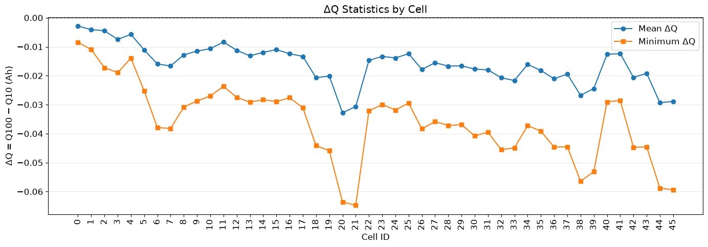   | 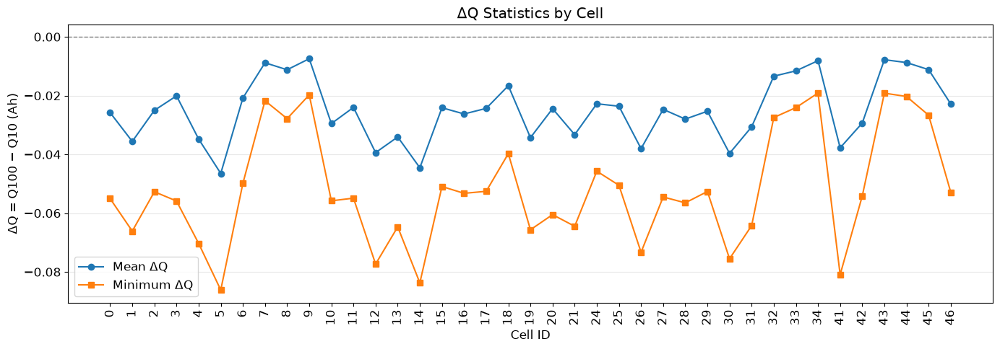   | 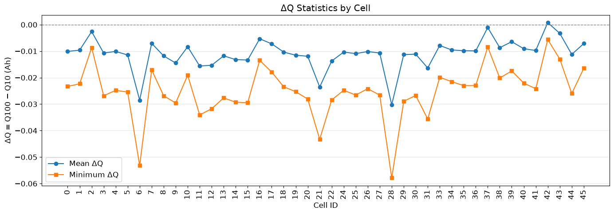   |

</details>

- 충전 속도(C-rate)와 수명의 관계
	- Batch 1에서 `8C(15%)-3.6C`의 평균 수명은 약 1,008.5사이클, `8C(35%)-3.6C`는 약 607.5사이클이다.
	- Batch 2는 같은 프로토콜 표기에서도 `newstructure` 유무에 따라 평균 수명에 차이가 있다. Batch 3에서도 첫 단계 C-rate가 가장 낮은 프로토콜이 최장수명은 아니다.
	- 핵심 발견 : 첫 단계 또는 최대 C-rate만으로 수명을 설명하기 어렵다. 전환 SOC·후속 전류·실험 조건을 함께 고려해야 하며, 프로토콜별 표본 수가 적어 인과관계로 단정하지 않는다.


<details>
<summary>충전 프로토콜과 전류 패턴 분석</summary>

| 그림                        | Batch 1                                                                           | Batch 2                                                                           | Batch 3                                                                           |
| --------------------------- | --------------------------------------------------------------------------------- | --------------------------------------------------------------------------------- | --------------------------------------------------------------------------------- |
| 프로토콜별 평균 수명 표     | 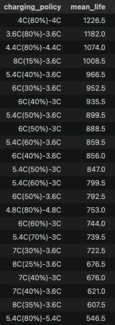              | 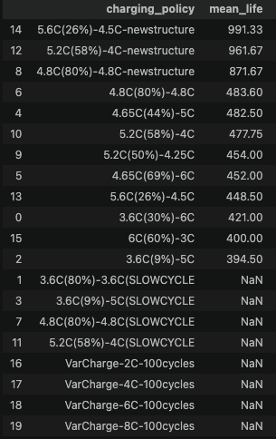              | 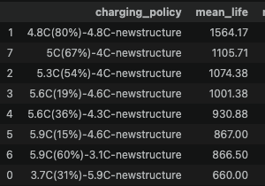              |
| 프로토콜별 평균 수명 그래프 | 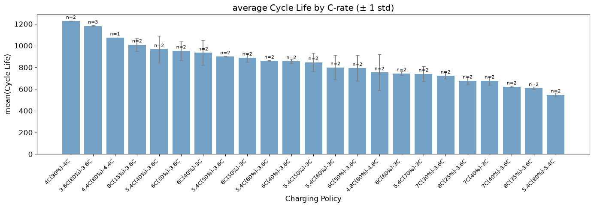           | 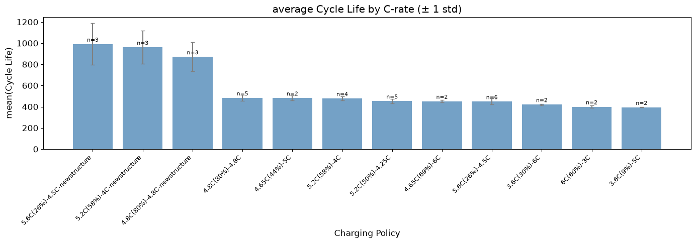           | 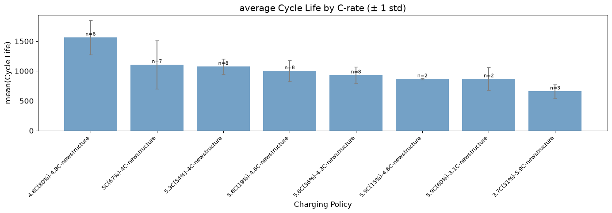           |
| 전류 패턴과 전체 열화 속도  | 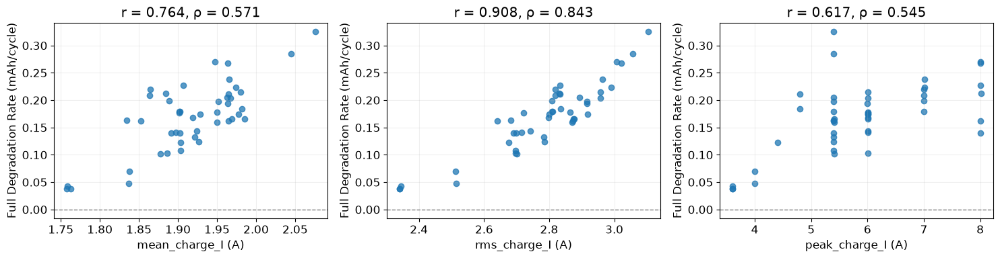 | 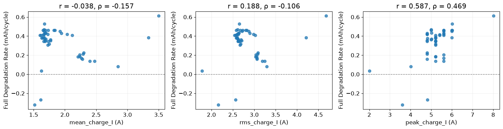 | 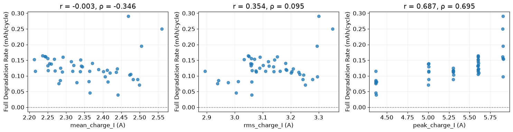 |

</details>

- 초기 특징과 수명의 상관관계
	- 평균 충전시간은 Batch 1·3에서 수명과 각각 약 +0.58, +0.64의 상관을 보인다. 평균 온도는 Batch 1에서 약 -0.48, Batch 2에서 약 +0.42로 방향이 다르다.
	- 평균 온도와 최대 온도는 Batch 1·3에서 약 0.96~0.97의 높은 상관을 보인다.
	- 핵심 발견 : 상관계수만으로 인과관계나 예측력을 확정하지 않는다. 최종 선정한 두 ΔQ 피처만 이번 모델에 사용하고, 추가 피처는 별도 실험 후보로 남긴다.


<details>
<summary>초기 100사이클 상관관계 Heatmap</summary>

| 그림     | Batch 1                                                   | Batch 2                                                   | Batch 3                                                   |
| -------- | --------------------------------------------------------- | --------------------------------------------------------- | --------------------------------------------------------- |
| 상관관계 | 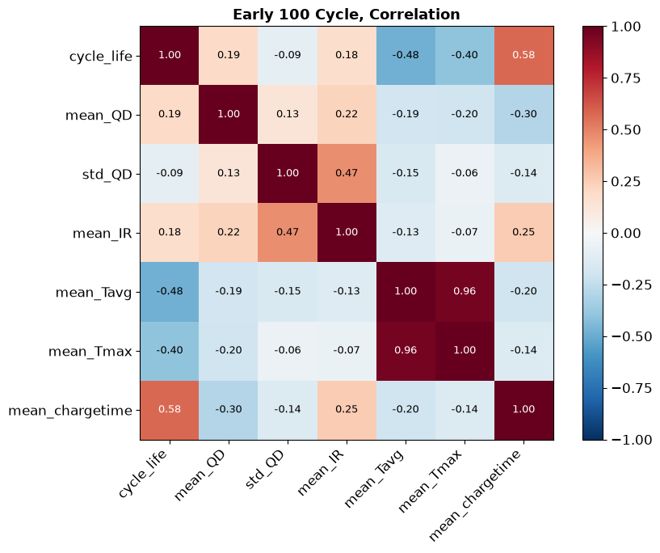 | 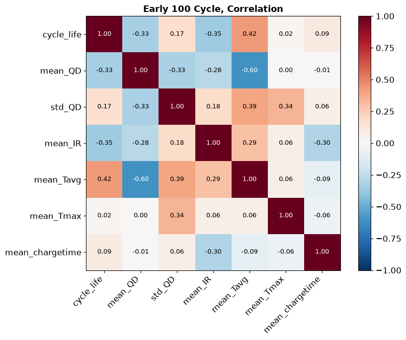 | 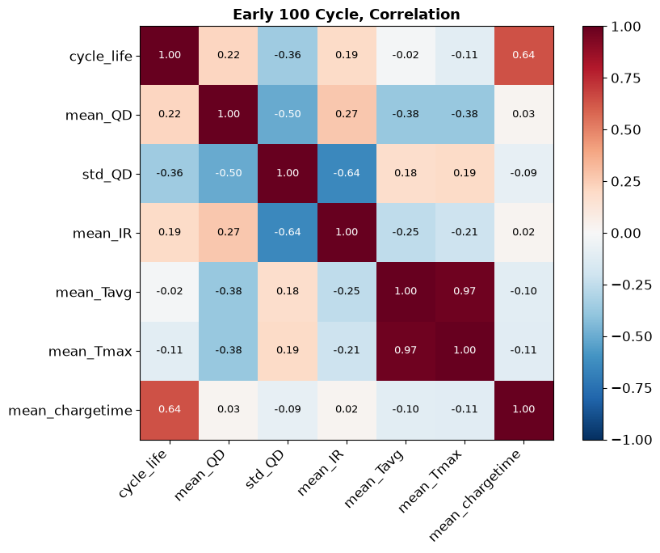 |

</details>

## Modeling 

### 피처 엔지니어링 전략
- `dq_min = min_V[Q100(V) - Q10(V)]`: 같은 전압에서 가장 큰 음의 용량 변화를 포착한다. 단위는 Ah이다.
- `log_dq_var = log10(var_V[Q100(V) - Q10(V)] + 1e-12)`: 한 셀의 곡선 내부에서 전압별 변화량의 퍼짐을 나타낸다. 작은 분산의 크기 차이를 로그로 표현하며 0의 로그를 방지한다.
- 실제 사이클 번호로 10·100번을 식별하고 해당 곡선만 읽는다. 전압축을 정렬하며 중복 전압·유효점 부족 등의 오류를 기록한다.
- **특징 전처리보다 먼저** Batch 1을 Train 33셀(17개 프로토콜), Valid 13셀(6개 프로토콜)로 분리한다. `GroupShuffleSplit(test_size=0.25, random_state=42)`를 사용하며 25%는 프로토콜 그룹 비율이다.
- 단순 셀 Hold-out만으로 프로토콜 중복을 막을 수 없으므로, Hold-out과 CV 모두 동일 충전 프로토콜의 셀을 함께 묶는다. 셀 내부 시점은 무작위로 섞지 않는다.
- `DeltaQFeatures → SimpleImputer(median) → StandardScaler → Regressor` Pipeline을 사용한다. 공통 전압 범위와 1,000점 격자는 각 학습 부분에서만 결정한다.
- 고정 전압 범위를 덮지 못하는 곡선은 외삽하지 않고 NaN으로 처리한다. 결측 대체·표준화도 각 CV fold의 train에서만 fit한다.
- 수명 누락·무효 셀, 100사이클 이전 EOL 또는 필요한 사이클이 없는 셀은 사유와 함께 제외한다. 타깃 IQR 이상치는 자동 제거하지 않는다.
- 셀 ID·프로토콜·바코드는 분할·감사용으로만 사용한다. 전체 열화 속도, 후기 Knee, 수명 그룹, 최종 관측 길이는 입력에서 제외한다.
- 무작위성이 있는 모델·분할의 `random_state`와 NumPy/Python seed는 42로 고정한다. 결정적인 GroupKFold에는 별도 seed가 필요하지 않다.


### 모델 선택 및 근거
- 후보 모델 : Dummy Regressor, Ridge Regression, Elastic Net, RBF-SVR, RandomForest Regressor, Gradient Boosting Regressor
- 최종 모델 : **Ridge Regression (`alpha=0.1`)**
- 선택 이유 : Batch 1 Train 부분의 3-fold Nested Group CV 평균 MAPE가 7.89%로 후보 중 가장 낮았다. 바깥 CV는 평가, 안쪽 Group CV는 튜닝에 사용한다. Valid와 Test로 모델을 재선택하지 않았다.
- EDA와 후보 모델의 연결 :
	- Dummy: Batch별 수명 분포 차이가 있어 중앙값 예측 대비 개선을 확인하는 기준 모델이다.
	- Ridge: 두 ΔQ 특징의 선형 관계를 평가하고 정규화로 계수의 불안정성을 줄인다.
	- Elastic Net: 정규화와 변수 선택을 함께 적용하는 비교 모델이다. 이번 입력은 두 변수이므로 변수 선택의 효과도 검증한다.
	- RBF-SVR: 초기 ΔQ 특징과 수명 사이의 비선형 관계를 표현하는 후보이다.
	- Random Forest: 두 ΔQ 특징의 비선형 상호작용을 표현하며 깊이·리프 크기를 제한해 소표본 과적합을 억제한다.
	- Gradient Boosting: 특징 구간에 따른 효과를 표현하며 얕은 트리와 작은 학습률로 비교한다.


## 성능 결과

| 구분                     | MAPE (%) | 비고                                        |
| ------------------------ | -------: | ------------------------------------------- |
| Train (Batch 1 CV)       |     7.89 |                                             |
| Valid (Batch 1 Hold-out) |    12.56 |                                             |
| Test (Batch 2)           |    25.47 |                                             |
| Gap (Train-Valid)        |    -4.66 | (−) : 과적합 의심, Gap 단위 pp              |
| Gap (Valid-Test)         |   -12.91 | (−) : 배치 간 일반화 저하 의심, Gap 단위 pp |
| Gap (Target-Test)        |   -16.37 | Target : 원논문 9.1%, Gap 단위 pp           |


## 오류 분석
- 저장된 Test 예측에서 APE가 가장 큰 세 셀은 아래와 같으며 모두 약 400~450사이클의 짧은 수명을 과대예측했다.

| Batch 2 셀 ID | 프로토콜        | 실제 수명 | 예측 수명 | APE (%) |
| ------------- | --------------- | --------: | --------: | ------: |
| 18            | 5.2C(50%)-4.25C |       449 |    733.43 |   63.35 |
| 6             | 3.6C(9%)-5C     |       393 |    641.51 |   63.23 |
| 15            | 3.6C(9%)-5C     |       396 |    634.92 |   60.33 |

- 세 셀 모두 두 특징의 결측 대체가 발생하지 않았다. 따라서 해당 오류를 입력 결측만으로 설명하기 어렵다.
- 원인 가설: Batch 1에 <500사이클 셀이 없고 Batch 2는 단수명 비중이 높아, 학습 범위 밖 수명에 대한 일반화가 어려울 수 있다. 두 ΔQ 특징만으로 충전·실험 조건 차이를 충분히 표현하지 못했을 가능성도 있다.
- 개선 방향: 별도 개발 실험에서 단수명 학습 셀 확보, 초기 충전시간·단계별 C-rate·전환 SOC 추가, EOL 정의·측정 이력 확인을 검토한다. 현재 Test 결과에 맞춘 재튜닝은 수행하지 않았으며, 추가 모델의 최종 평가에는 새로운 미사용 데이터가 필요하다.

## 지표 해석과 한계

- MAPE는 작을수록 좋습니다. Gap은 요청대로 **왼쪽−오른쪽**이며, 음수는 오른쪽 오차가 더 큼을 뜻합니다.

- Train−Valid는 CV 평균과 독립 Hold-out의 차이입니다. 일반적인 학습 내 오차와의 차이가 아니므로 차이는 과적합뿐 아니라 검증 프로토콜의 난이도와 소표본 변동도 반영합니다.

- Valid−Test는 Batch 간 일반화 차이, Target−Test는 9.1% 참고값과의 차이(percentage points)입니다.

- Batch 간 조건·수명 분포가 달라 Test 오차가 증가할 수 있습니다. 결과를 보고 Test에
  맞춘 튜닝을 수행하지 않습니다. 이후 추가 실험은 새로운 미사용 평가 데이터가 필요합니다.

- 누락 수명이 EOL 미도달에 따른 중도 종료라면 일반 회귀에서 제외할 때의 선택 편향을 확인해야 합니다. 원본 cycle_life를 사용하며 EOL 정의나 연속 측정 보정은 추측으로 변경하지 않습니다.

- 바코드를 읽지 못한 셀의 물리적 독립성은 파일 기록만으로 완전히 보장할 수 없습니다.

- Pipeline은 전처리 fit 범위를 제한합니다. 이후 실운용에서도 특징 추출 사양을 고정해야 합니다.


## ESS 도메인 해석
분석 결과를 실제 ESS 운영 관점에서 해석

- 이 모델을 실제 BESS에 적용한다면 어떤 의사결정에 활용 가능한가?
    현재 모델은 BESS의 자동 제어보다 셀 평가와 점검 우선순위를 정하는 보조 도구로 활용하는 것이 적절합니다.

    - **활용 가능한 의사결정**
      - *셀 입고·선별*: 초기 100사이클 평가 후 예상 수명이 짧은 셀을 추가 검사 대상으로 선정합니다.
  
      - *점검 우선순위*: 수명이 짧게 예측된 셀·모듈의 용량과 온도 등을 먼저 점검하는 참고자료로 활용합니다. 모듈 단위 적용은 별도 검증이 필요합니다.

      - *교체·예비품 계획*: 현장 데이터로 검증한 이후, 교체 수요와 예비품 확보 계획을 지원할 수 있습니다.


- 어떤 한계가 있으며, 실 배포를 위해 추가로 필요한 것은 무엇인가?
  
  - **현재 한계**
    - *조건 변화에 취약*: Batch 1 CV MAPE 7.89%보다 Batch 2 오차가 크게 높고, 일부 단수명 셀의 수명을 과대예측했습니다.

    - *수명 표현의 한계*: 예측 대상은 총 Cycle Life입니다. 현재 시점의 잔여수명이나 사용 가능 연수를 직접 예측하지 않습니다.

    - *운영 특성 미반영*: 두 ΔQ 특징만 사용해 온도·SOC·불규칙 충방전과 보관 중 열화를 충분히 반영하지 못합니다. 실제 수명 평가에는 사이클 열화와 달력 열화를 함께 고려해야 합니다. 

    - *측정 제약*: 현장에서 사이클 10·100의 Q(V)를 동일한 조건으로 확보할 수 있는지 확인해야 합니다.
  
  - **실 배포 전 필요한 사항**
    1. *현장 데이터 검증*: 목표 BESS의 셀 종류·운전 조건에서 검증하고, 셀 예측이 모듈·랙 수준에서도 유효한지 확인합니다.

    2. *측정·EOL 기준 통일*: 전압 격자, 용량 측정 조건, 사이클 정의와 수명 종료 기준을 고정합니다.

    3. *불확실성 평가*: 예측 구간을 제공하고, 특히 실제보다 수명을 길게 예측하는 오류를 관리합니다.

    4. *운영 시험*: 먼저 실제 제어에 영향을 주지 않는 방식으로 예측을 기록하고, 점검 결과와 비교합니다.

    5. *BMS와 역할 구분*: 이 모델은 수명 추정용입니다. 과전압·과온 등 기존 보호 기능과 안전 감시는 별도로 유지해야 합니다.


## 참고문헌
- Severson et al. (2019). Data-driven prediction of battery cycle life before capacity degradation. *Nature Energy*, 4, 383–391.
- 데이터셋: https://www.kaggle.com/datasets/itshpark/data-driven-prediction-of-battery-cycle


## 팀 구성
- 엄진용 : EDA, 피처 엔지니어링, 모델 개발, 성능 평가(Batch1, Batch2)
